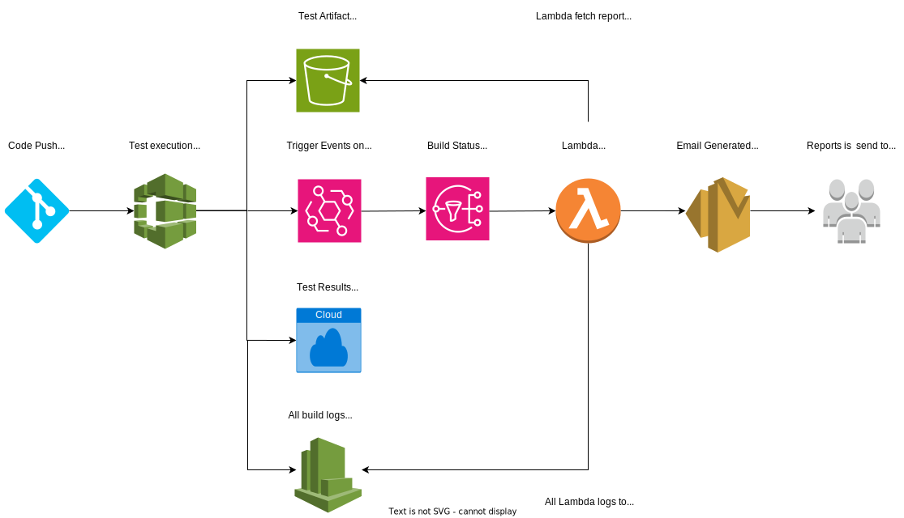

## What is this Framework
This is a Test Automation framework mainly developed with help of cypress

## Tech Stack Used for this Framework
1. Node.js (JS runtime environment)
2. NPM (Node Package Manager)
3. Cypress (Automation Tool for Testing JS Web apps)
4. GitHub (To host the code on repo)
5. AWS code build (To build and test the application/ No build required as testing website directly but can be done)
6. Cypress cloud (To record all test execution related on cloud)
7. AWS SNS notification as per build status. Refer :- https://docs.aws.amazon.com/codebuild/latest/userguide/sample-build-notifications.html#sample-build-notifications-ref
8. AWS S3 to store code artifacts in this case test result report.
9. AWS Event bridge to initialize the email when build status is changed
10. AWS Lambda function in python to create the email and AWS SES to send the email with test artifact/report to user.

## Below is the complete Infrastructure used for this framework

  

